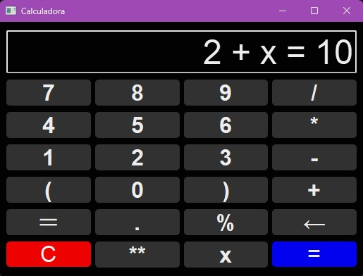

# Python Calculator Project

## Project Description

This project is a comprehensive Python-based calculator application designed to perform both basic and advanced mathematical operations. It features a graphical user interface (GUI) built with PyQt5, allowing users to input equations and calculate results easily. The calculator supports standard operations such as addition, subtraction, multiplication, and division, as well as advanced functionalities like solving equations with variables.

The application is built using Python and incorporates keyboard input support for enhanced user experience. Below is a screenshot of the calculator interface for reference:

<div align="center">
    
</div>

## Features

- **Basic Operations**: Addition, Subtraction, Multiplication, Division.
- **Advanced Operations**: Solving equations, handling percentages, exponents, and parentheses.
- **User-Friendly Interface**: Intuitive button layout and support for keyboard input.
- **Error Handling**: Robust error detection and handling for invalid inputs.
- **Variable Support**: Ability to solve equations with variables.

## Directory Structure

The project is organized into the following directories and files:

```plaintext
calculator
    ├── app
    │   ├── __init__.py
    │   ├── calculator.py
    │   ├── ui.py
    │   └── utils.py
    ├── screenshot
    │   └── screen.jpg
    ├── tests
    │   ├── __init__.py
    │   └── test_calculator.py
    └── main.py
```

### Directory and File Descriptions

- **app/**: Contains the core application logic and modules.
  - **__init__.py**: Marks the directory as a Python package.
  - **calculator.py**: Implements the calculator logic and operations.
  - **ui.py**: Manages the graphical user interface using PyQt5.
  - **utils.py**: Provides utility functions used across the application.

- **screenshot/**: Contains images and screenshots related to the project.
  - **screen.jpg**: Screenshot of the calculator interface.

- **tests/**: Includes unit tests for the application.
  - **__init__.py**: Marks the directory as a Python package.
  - **test_calculator.py**: Contains test cases for the calculator functionalities.

- **main.py**: Entry point of the application. Runs the calculator application.

## Getting Started

### Prerequisites

To run this calculator, you'll need to have Python installed on your machine. You can download Python from the [official website](https://www.python.org/).

### Installation

1. Clone the repository:

   ```sh
   git clone https://github.com/AlexsanderMe/calculator.git
   ```

2. Navigate to the project directory:

   ```sh
   cd calculator
   ```

3. To start the calculator application, run the following command:

   ```sh
   python main.py
   ```


### Running Tests

To run the unit tests, use the following command:

```sh
pytest
```

## Usage

- **Basic Operations**: Click the buttons on the interface or use the keyboard to input numbers and operations.
- **Solving Equations**: Use `x` to represent the variable and `=` to define the equation (e.g., `2 + x = 10`).

## Contributing

Contributions are welcome! Please follow these steps to contribute:

1. Fork the repository.
2. Create a new branch (`git checkout -b feature-branch`).
3. Commit your changes (`git commit -m 'Add some feature'`).
4. Push to the branch (`git push origin feature-branch`).
5. Open a pull request.

## License

This project is licensed under the GPL-3.0 License. See the [LICENSE](LICENSE) file for details.

---

Feel free to reach out if you have any questions or need further assistance with this project. Happy coding!
